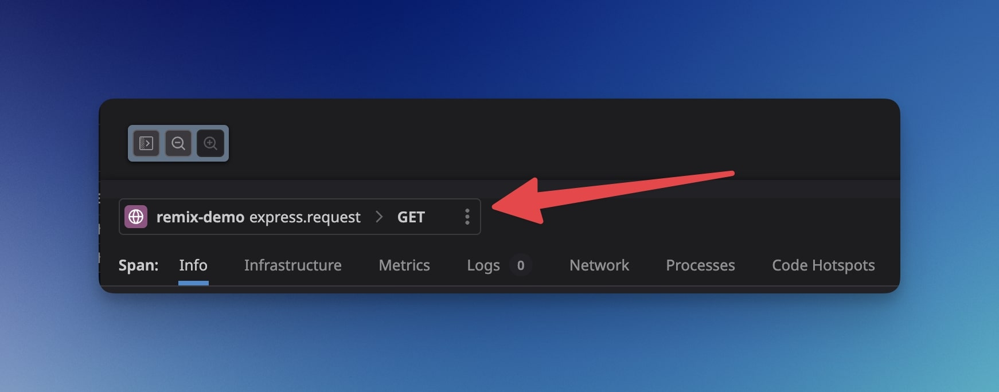
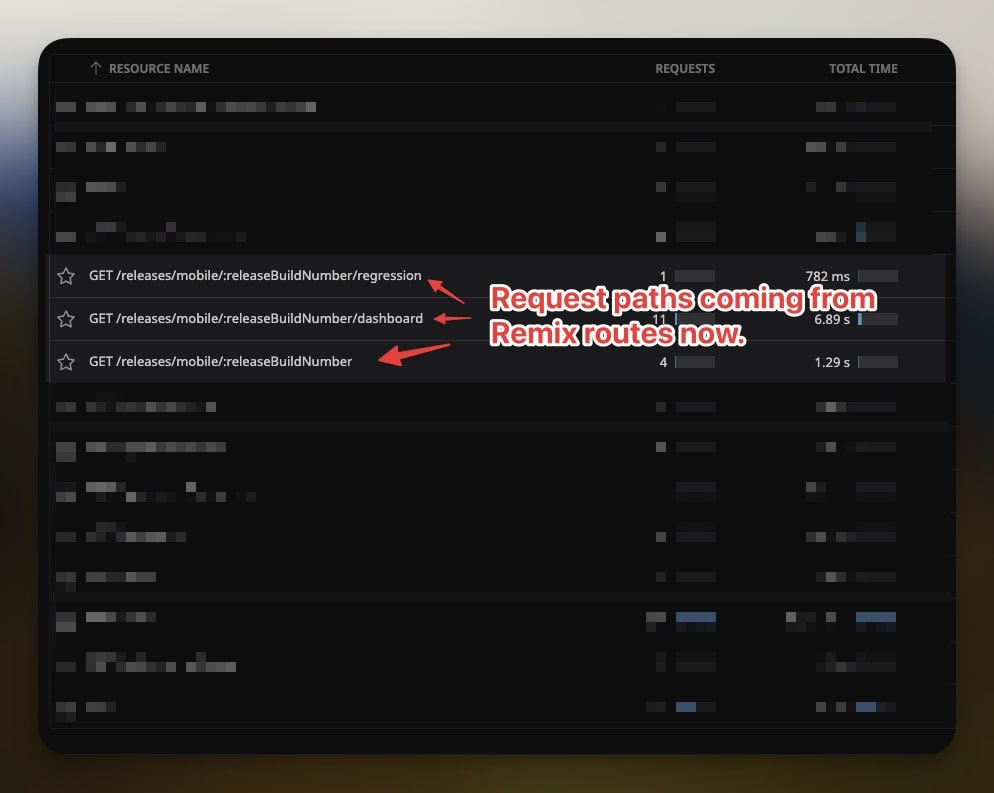

## Remix Datadog Route Matcher

Make better Datadog traces for [Remix](https://remix.run/) applications using
[Express](https://expressjs.com/).

### Installation

pnpm

```shell
pnpm add remix-datadog-express-tracing
```

npm

```shell
npm install -S remix-datadog-express-tracing
```

## Why this library?

When using [Datadog](https://www.datadoghq.com/) for collecting telemetry from
your backend services, one of the best features Datadog provides is
[distributed tracing](https://www.datadoghq.com/knowledge-center/distributed-tracing/).

While Datadog works out-of-the-box with many frameworks like
[Express](https://expressjs.com/), the route handler we have from Remix does not
work properly due to being a catch-all handler when using an Express server.

This limits the ability of debugging on which URL pattern our request traces are
hitting as everything will be marked under the `/` route in Datadog.

The Datadog team is aware about this (See this
[issue here](https://github.com/DataDog/dd-trace-js/issues/3283#issuecomment-1653821725))
and while they are more invested in the NextJS ecosystem, there are no plans to
prioritize Remix at the moment.

## Dynamically enriching Datadog traces

To fix this, we must tap into the Datadog tracer hooks so we can enrich the
trace with the `http.route` tag that will give us proper visibility on specific
route patterns. By using this library we move out from this:



To this:



This renders in a substantial improvement given that we can narrow down issues
to specific routes instead, facilitating debugging and improving the DX when
using the Datadog tracing UI.

## How to use this library

This library exposes a single registration callback that injects our own hooks
to the Datadog tracer. This is not meant to be used in code and does not expose
any public APIs.

Although, this library takes a single input:

- A generated routes file from the Remix CLI. During the build process, you can
  generate this file with:

```shell
pnpm exec remix routes --json >> ./build/remix_routes.json
```

Once this file is generated, you must define the following environment variable:

- `REMIX_DD_ROUTE_FILE`

```shell
export REMIX_DD_ROUTE_FILE="./build/remix_routes.json"
```

Now during your server startup script, you must call this with ESM only Node
apps (as described here in the
[dd-trace docs](https://github.com/DataDog/dd-trace-js?tab=readme-ov-file#ecmascript-modules-esm-support))
just after initializing the Datadog tracer with the following:

```shell
node --import dd-trace/register.js --import remix-datadog-express-tracing my_app.js
```

If you are starting up your app via Docker:

```Dockerfile
ENV REMIX_DD_ROUTE_FILE="./build/remix_routes.json"
CMD ["node", "--import", "dd-trace/register.js", "--import", "remix-datadog-express-tracing", "./build/express/index.js"]
```

## Dependencies

This package depends on the following peer dependencies:

- [x] [@remix-run/react](https://www.npmjs.com/package/@remix-run/react)
      compatible with version ^2
- [x] [dd-trace](https://www.npmjs.com/package/dd-trace) compatible with version
      ^5
